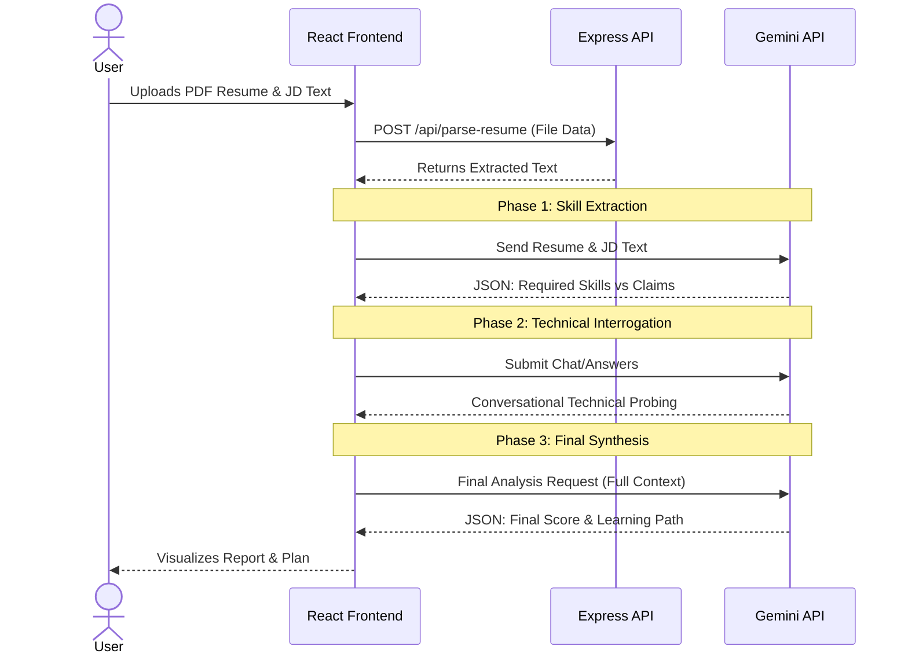

# System Architecture

The application is built on a modern, decoupled React frontend + Express API architecture, optimized for fast iterative development and seamless serverless deployment (Vercel).

## High-Level Architecture

1. **Frontend (React/Vite)**
   - **UI Layer**: TailwindCSS for styling, `lucide-react` for iconography, and `framer-motion` for fluid state transitions.
   - **State Management**: React `useState` and `useEffect` orchestrate the multi-step flow (Upload -> Analyzing -> Assessment -> Plan).
   - **Client-side API Client**: The `GoogleGenAI` SDK (`@google/genai`) is executed securely on the client (or could be moved to the backend based on environment configurations if needed).

2. **Backend (Express)**
   - **File Parsing API**: `/api/parse-resume` receives a PDF file via `multer` (in-memory storage), parses it using `pdf-parse`, and returns the raw text context.
   - **Development Integration**: Vite middleware is mounted in the Express app for a seamless local dev experience (`npm run dev`), handling Hot Module Replacement in local setup.
   - **Production Integration**: Static endpoints are rewritten for Express. Vercel deployment utilizes serverless functions automatically mapped via `vercel.json`.

3. **AI Engine (Gemini-3-Flash-Preview)**
   - **Structured Data Extraction JSON Mode**: Leverages `responseSchema` for precise skill parsing.
   - **Contextual NLP Interrogator**: Employs continuous multi-turn chat history to simulate a realistic human technical interview.

## Data Flow Diagram

